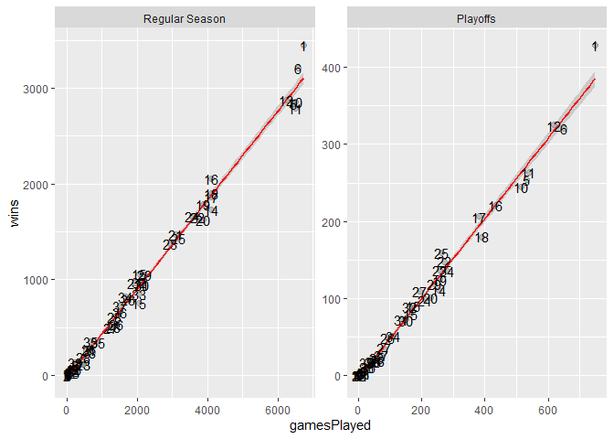

ST558 Project 1
================
Tao Sun
2020-06-09

# **JSON data description**

**JSON** (JavaScript Object Notation) is a lightweight and flexible data
format that is easy for humans to read and for machines to parse. JSON
has become a common format used in:

  - Public APIs (e.g., Twitter)
  - NoSQL databases as a document format (e.g., MongoDB)
  - Relational databases as a new column type (e.g., PostgreSQL)

JSON format is text only and independent to any programming language, so
it is a good way to store data.

[Wikipedia introduction](https://en.wikipedia.org/wiki/JSON) and [JSON
syntax introduction](http://json.org/).

# **Ways to read JSON data into R**

There three major R packages available for reading JSON data into R
(rjson, RJSONIO and jsonlite). Examples to compare behavior and
performance of those three packages are
[here](https://rstudio-pubs-static.s3.amazonaws.com/31702_9c22e3d1a0c44968a4a1f9656f1800ab.html).
I prefer jsonlite because it provides more options for manipulating the
format and most importantly we can get well formatted data by default.

# **Access NHL records ‘Franchise’ API and pulldown JSON data**

Function used to pull down “Francise” records.

``` r
get_franchise <- function(endpoint,team_ID=NULL){
  base <- "https://records.nhl.com/site/api/"                 # API base
  
    if (!(endpoint %in% c("franchise","franchise-team-totals","franchise-season-records",
                          "franchise-goalie-records","franchise-skater-records"))) 
      stop("URL is not correct!")
  
    if (is.null(team_ID)) get_URL <- paste0(base, endpoint)
      else if (!(team_ID %in% c(1:38))) stop("Team ID is not correct!")
        else get_URL <- paste0(base, endpoint, "?cayenneExp=franchiseId=", team_ID) 

  get_request <- GET(get_URL)                                 # Get raw data
  get_request_text <- content(get_request, as = "text", encoding = "UTF-8") # Get contents
  get_request_json <- fromJSON(get_request_text, flatten=TRUE)# Parse to list
  get_request_tbl <- as_tibble(get_request_json$data)         # Convert to tibble
  return(get_request_tbl)                                     # Return a table
}
```

Pull down data.

``` r
franchise <- get_franchise("franchise")
team_totals <- get_franchise("franchise-team-totals")
season_records <- get_franchise("franchise-season-records", 1)
goalie_records <- get_franchise("franchise-goalie-records", 1)
skater_records <- get_franchise("franchise-skater-records", 1)
```

# **Exploratory data analysis**

Only New York City has more than one team in NHL

``` r
# Select active team and find city with more tahn one team
team <- franchise %>% filter(is.na(lastSeasonId)) %>% 
                           select(id, firstSeasonId, teamCommonName, teamPlaceName) 
teamN <- team %>% group_by(teamPlaceName) %>% summarize(n=n())%>% arrange(desc(n)) %>% filter(n>1) %>% rename(`City Name`=teamPlaceName, `Team Number`=n)
kable(teamN)
```

| City Name | Team Number |
| :-------- | ----------: |
| New York  |           2 |

``` r
# Commented out for knit reason;
#datatable(team_info, 
#          rownames=NULL, 
#          colnames=c("Franchise ID","First Season","Team Name","Team City"),
#          caption = "Current NHL teams")
```

# **The team with highest winning ratio in NHL history**

All records of number of games a team played and wined was retrieved and
ploted as below. all the teams seems have very similar winning ratios,
except team “Montréal Canadiens”(\#1) showed extraordinary winning rate
in both regular season and playoffs. Interestingly, team “Edmonton
Oilers”(\#25) has much better performance in playoffs than in the
regular seasons.

``` r
if (!is.factor(team_totals$gameTypeId)) {
  team_totals$gameTypeId <- factor(team_totals$gameTypeId, 
                                 levels = c(2, 3), 
                                 labels = c("Regular Season", "Playoffs"))
}

team_totals %>% ggplot(aes(x=gamesPlayed, y = wins)) + 
                geom_point(alpha = 0.2, size = 2, position = "jitter") + 
                geom_smooth(method = lm, col="Red") +
                facet_wrap(~ gameTypeId, scale="free") +
                geom_text(aes(label=franchiseId), position="jitter",size = 4)
```

<!-- -->

We can also see this from below two tables. Montréal Canadiens has the
highest wining ratio among teams who played more than 2500 games. Again,
Edmonton Oilers’s wining ratio is much higher in playoffs than in
regular seasons.

``` r
regular_season <- team_totals %>% mutate(ratio = round(wins/gamesPlayed,2)) %>% filter(gameTypeId=="Regular Season") %>% arrange(desc(ratio)) %>% select(teamName,franchiseId, gamesPlayed, wins,ratio)

playoffs <- team_totals %>% mutate(ratio = round(wins/gamesPlayed,2)) %>% filter(gameTypeId=="Playoffs") %>% arrange(desc(ratio)) %>% select(teamName, franchiseId, gamesPlayed, wins, ratio)

kable(head(regular_season, 4), caption="Winning rato in regular seasons", rownames=NULL, colnames = c("Franchise ID", "Team Name", "Number of games played", "Number of games wined"))
```

| teamName             | franchiseId | gamesPlayed | wins | ratio |
| :------------------- | ----------: | ----------: | ---: | ----: |
| Vegas Golden Knights |          38 |         235 |  133 |  0.57 |
| Dallas Stars         |          15 |        2053 | 1061 |  0.52 |
| Montréal Canadiens   |           1 |        6731 | 3449 |  0.51 |
| Winnipeg Jets        |          35 |         693 |  352 |  0.51 |

Winning rato in regular seasons

``` r
kable(head(playoffs,4), caption="Winning rato in regular seasons",rownames=NULL, colnames = c("Franchise ID", "Team Name", "Number of games played", "Number of games wined"))
```

| teamName             | franchiseId | gamesPlayed | wins | ratio |
| :------------------- | ----------: | ----------: | ---: | ----: |
| Edmonton Oilers      |          25 |         264 |  159 |  0.60 |
| Vegas Golden Knights |          38 |          27 |   16 |  0.59 |
| Montréal Canadiens   |           1 |         749 |  429 |  0.57 |
| Toronto Arenas       |           5 |           7 |    4 |  0.57 |

Winning rato in regular seasons

``` r
# Commented out because Knit issue with github

#datatable(regular_season, caption="Winning rato in regular seasons", rownames=NULL, colnames = c("Franchise ID", "Team Name", "Number of games played", "Number of games wined"))

#datatable(playoffs, caption="Winning rato in regular seasons",rownames=NULL, colnames = c("Franchise ID", "Team Name", "Number of games played", "Number of games wined"))
```

# **Further check Montreal Canadiens team’s plalyers in each position**

## The former and active players in each position.

Seems that Montreal Canadiens need more player on the right wing
position.

``` r
tbl <-table(skater_records$activePlayer, skater_records$positionCode)
rownames(tbl) <- c("Former player", "Current player")
colnames(tbl) <- c("Center", "Defence", "Left Wing", "Right Wing")

knitr::kable(tbl)
```

|                | Center | Defence | Left Wing | Right Wing |
| -------------- | -----: | ------: | --------: | ---------: |
| Former player  |    178 |     218 |       165 |        163 |
| Current player |     17 |      27 |        12 |          8 |

## Who is the active player got highest average scores/season in the team.

Tomas Tatar is the player in the team who got the highest average
scores/season. Max Pacioretty is definitely the super star in the team
who performed so well in the past 10 seasons.

``` r
top_players <- skater_records %>% filter(activePlayer == TRUE) %>% 
                   mutate(AvergePoints = round(points/seasons,2)) %>% 
                   arrange(desc(AvergePoints)) %>% 
                   unite(Name, firstName, lastName, sep=" ")%>%
                   select(Name, seasons, points, AvergePoints) %>%
                   rename(`Player Name`=Name, `Number of Seasons Played`=seasons, 
                          `Total Points`=points, `Average Points/Seson`=AvergePoints)

kable(head(top_players,6))               
```

| Player Name       | Number of Seasons Played | Total Points | Average Points/Seson |
| :---------------- | -----------------------: | -----------: | -------------------: |
| Tomas Tatar       |                        2 |          119 |                59.50 |
| Max Domi          |                        2 |          116 |                58.00 |
| Alexander Radulov |                        1 |           54 |                54.00 |
| Max Pacioretty    |                       10 |          448 |                44.80 |
| Alex Galchenyuk   |                        6 |          255 |                42.50 |
| Brendan Gallagher |                        8 |          334 |                41.75 |
